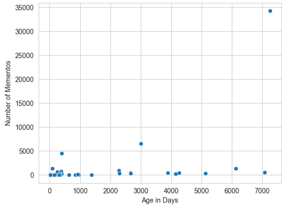

# Homework 2 - Archiving the Web
**Due:** Tuesday, October 11, 2022 by 11:59pm
 *This assignment is going to take time. Read through the entire assignment before starting. *Do not wait until the last minute to start working on it.*

**Important:** Q1 requires obtaining a Twitter Developer Account (see [Twitter Setup](/fall-2022/homework/hw0/twitter_setup.md)).  This may take a day or two, so if you haven't already done this, get started today.

## Assignment

Write a report that contains the answers and *explains how you arrived at the answers* to the following questions. Include any interesting findings that you discover from your analysis.  

**Note about Programming Tasks:** For several of the programming tasks this semester, you will be asked to write code to operate on 100s or 1000s of data elements.  If you have not done this type of development before, I *strongly encourage* you to start small and work your way up.  Especially when you are using new tools or APIs, start on a small test dataset to make sure you understand how to use the tool and that your processing scripts are working before ramping up to the full set. *This will save you an enormous amount of time.*

(**Report (2 points**)

### Q1. Collect URIs from Tweets (2 points)

Extract 1000 unique links from tweets in Twitter.

Setup for this task:
* Obtain a Twitter Developer Account (see [Twitter Setup](/fall-2022/homework/hw0/twitter_setup.md))
* You may use [`get_tweets.py`](/fall-2022/homework/hw0/get_tweets.py) and [`process_tweets.py`](/fall-2022/homework/hw0/process_tweets.py)). Modify them as needed.

Main steps:
* Write a Python program that collects English-language tweets that contain links. See [Collecting Tweets](#collecting-tweets).
* Write a Python program that extracts the links shared in tweets. See [Extracting Links from Tweets](#extracting-links-from-tweets).
* Resolve all URIs to their final target URI (i.e., the one that responds with a 200). See [Resolve URIs to Final Target URI](#resolve-uris-to-final-target-uri).
* Save only unique final URIs (no repeats). See [Save Only Unique URIs](#save-only-unique-uris).
  * if after this step, you don't have 1000 unique URIs, go back and gather more until you are able to get at least 1000 unique URIs
* Save this collection of 1000 unique links in a file and upload it to your repo in GitHub -- we'll use it again in [HW3](/fall-2022/homework/hw3/README.md)

#### Collecting Tweets

You'll likely need to collect more than 1000 tweets initially to get 1000 unique links.

There are [rate limits](https://developer.twitter.com/en/docs/twitter-api/rate-limits) (number of API calls per amount of time) associated with different types of API calls to Twitter, but twarc will handle the rate limits for you. Meaning, if you ask twarc to deliver more tweets than it is allowed per time, it will pause until it's able to complete your request.

Feel free to use multiple keywords to extract tweet. For example, you could collect 250 tweets each about 5 different keywords.  Use keywords (e.g., `'covid'`, `'olympics'`, `'vaccine'`) and not "stopwords" (e.g., `test`, `the`, `tweet`).  

#### Extracting Links from Tweets

Links in tweets are stored in the `['entities']['urls']` part of the [tweet dictionary structure](https://developer.twitter.com/en/docs/twitter-api/data-dictionary/object-model/tweet).  This has several components:
* `'url'` - The shortened URI (usually starting with https://t.co/)
* `'expanded_url'` - The actual URI that was input by the user (i.e., not shortened)
* `'display_url'` - The text of the URI that is displayed in the tweet (counted as part of the 280-character limit in the tweet)

Since we want the actual URIs, you want to extract the `'expanded_url'` version of the link.  There's an example in `process_tweets.py`.

We will be analyzing the content in these links in a later assignment, so you want links that will likely contain some text.  
* Exclude links from the Twitter domain (twitter.com) -- these will likely be references to other tweets or images
* Exclude links that will likely point to a video/audio-only page (youtube.com, twitch.com, soundcloud.com, etc.)

*If you find a link you consider to be inappropriate for any reason, just discard it and get some more links.*  

#### Resolve URIs to Final Target URI

Many of the links that you collect will be shortened links (dlvr.it, bit.ly, buff.ly, etc.).  We want the final URI that resolves to an HTTP 200 (not a redirection).  For example:

```console
$ curl -IL --silent http://bit.ly/wc-wail | egrep -i "(HTTP/1.1|HTTP/2|^location:)"
HTTP/1.1 301 Moved Permanently
Location: http://ws-dl.blogspot.com/2013/07/2013-07-10-warcreate-and-wail-warc.html
HTTP/1.1 301 Moved Permanently
Location: https://ws-dl.blogspot.com/2013/07/2013-07-10-warcreate-and-wail-warc.html
HTTP/2 200
```

We want <https://ws-dl.blogspot.com/2013/07/2013-07-10-warcreate-and-wail-warc.html>, not <http://bit.ly/wc-wail>.

You can either write a Unix shell script that uses `curl` to do this, or write a Python program using the [requests library](https://requests.readthedocs.io/en/master/).  If you use the Python requests library, make sure to include the [timeout](https://docs.python-requests.org/en/master/user/quickstart/#timeouts) parameter to your call to `get()`.  
* Example: `requests.get(url, timeout=5)   # 5 second timeout`

#### Save Only Unique URIs

You can write Python code for this part, but I'd recommend using the Unix tools `sort` and `uniq`.  [Back to Basics: Sort and Uniq](https://www.linuxjournal.com/content/back-basics-sort-and-uniq) is a nice introduction to this.
 
### Q2. Get TimeMaps for Each URI (2 points)

Obtain the [TimeMaps](http://www.mementoweb.org/guide/quick-intro/) for each of the unique URIs from Q1 using the ODU Memento Aggregator, [MemGator](https://github.com/oduwsdl/MemGator).  

*You may use https://memgator.cs.odu.edu for limited testing, but do not request all of your 1000 TimeMaps from memgator.cs.odu.edu*.  

There are two options for running MemGator locally:
* Install a stand-alone version of MemGator on your own machine, see https://github.com/oduwsdl/MemGator/releases
  * This was described in [How to Install MemGator](/fall-2022/homework/hw2/install_memgator.md)
* Install [Docker Desktop](https://www.docker.com/products/docker-desktop) and run MemGator as a Docker Container, see notes at https://github.com/oduwsdl/MemGator/blob/master/README.md

**Important:** Obtaining TimeMaps requires contacting several different web archives for each URI-R.  *This process will take time.*
Look at the MemGator options and figure out how to process the output before running the entire process.  You might want to get JSON output, or you might want to limit to the top *k* archives (especially if there's one that's currently taking a long time to return).

Note that if there are no mementos for a URI-R, MemGator will return nothing. *Don't be surprised if many of your URI-Rs return 0 mementos.*  Remember the "How Much of the Web is Archived" slides -- there are lots of things on the web that are not archived.  If you want to do a sanity check on a few, you can manually use the Wayback Machine and see what you get from the Internet Archive.  (Remember though that MemGator is going to query several web archives, not just Internet Archive.)

If you uncover TimeMaps that are very large (e.g., for popular sites like <https://www.cnn.com/>) and swamp your filesystem, you have two options:
* Manually remove those URI-Rs from your dataset (but note this in your report), or
* Compress each TimeMap file individually (using pipe to `gzip` in the same command when downloading or after the download is completed). These compressed files can be used for further analysis by decompressing on the fly using commands like `zcat` or `zless` (or using gzip libraries in Python).

Finally, upload the TimeMaps to your GitHub repo -- you'll also use these for Q3.  Put them in a separate folder, not the same folder as your report.
* To upload/commit a large number of files to GitHub, [use the command line](https://docs.github.com/en/github/managing-files-in-a-repository/adding-a-file-to-a-repository-using-the-command-line).

### Q3. Analyze Mementos Per URI-R. (2 points)

Use the TimeMaps you saved in Q2 to analyze how well the URIs you collected in Q1 are archived. Create a table showing how many URI-Rs have certain number of mementos.  For example

|Mementos | URI-Rs |
|---------:|--------:|
|   0     |  750   |
|   1     |  100   |
|   7     |   50   |
|   12     |   25   |
|   19     |   25   |
|   24     |  20  |
|   30     |   27   |
|  57     |    3   |

If you are using LaTeX, you should create a [LaTeX table](https://www.overleaf.com/learn/latex/tables) -- don't submit a spreadsheet or image of a table created in something else.  If you are using Markdown, you can view the source of this file for an example of how to generate a table.

If you will end up with a very large table of memento counts, you can bin the number of mementos.  Just make sure that the bin sizes are reasonable and that you specify how many had 0 mementos individually. The target is to have no more than 15-20 rows so that your table can fit on a single page.  For example

|Mementos | URI-Rs |
|---------:|--------:|
|   0     |  750   |
|   1-10     |  150   |
|   11-20     |   50   |
|   21-30     |   47   |
|  57     |    3   |

*Q: What URI-Rs had the most mementos?  Did that surprise you?*
 
### Q4. Analyze Datetimes of Mementos. (2 points)

For each of the URI-Rs from Q3 that had > 0 mementos, create a scatterplot with the age of each URI-R (`today - earliest memento datetime`) on the x-axis and number of mementos for that URI-R on the y-axis. Some Info Vis terminology: for this graph, the item is the URI-R and the attributes are the estimated age of the URI-R (channel is horizontal position) and the number of mementos for that URI-R (channel is vertical position).

An example is shown below:



This scatterplot should be created using either R or Python, not Excel.

*Q: What can you say about the relationship between the age of a URI-R and the number of its mementos?*

*Q: What URI-R had the oldest memento? Did that surprise you?*

*Q: How many URI-Rs had an age of < 1 week, meaning that their first memento was captured the same week you collected the data?*                                                              
                                                                      
## Extra Credit 

### Q5. Explore Conifer and ReplayWeb.Page *(2 points)*

Create an account at [Conifer](https://conifer.rhizome.org) and create a collection.  Archive at least 10 webpages related to a common topic that you find interesting. Make the collection public and include the link to your collection in your report.

*Q: Why did you choose this particular topic?*

*Q: Did you have any issues in archiving the webpages?*

*Q: Do the archived webpages look like the original webpages?*

After creating your collection at Conifer, download the collection as a WARC file (see [Exporting or Downloading Content](https://guide.conifer.rhizome.org/docs/manage-sessions/exporting-warc/)).

Then load this WARC file into [ReplayWeb.page](https://replayweb.page), a tool from the Webrecorder Project (folks who developed Conifer).  From https://webrecorder.net/tools:

<blockquote>ReplayWeb.page provides a web archive replay system as a single web site (which also works offline), allowing users to view web archives from anywhere, including local computer or even Google Drive. See the <a href="https://replayweb.page/docs">User guide</a> for more info.</blockquote>

Once the WARC file has loaded, click on the "Pages" tab.  Take a screenshot that includes the list of pages and the browser address bar (showing `replayweb.page/?source=file%3A%2F%2F`..., which indicates that the WARC file is being loaded from your local computer).

Then click on the "URLs" tab and choose "All URLs" from the dropdown menu.  

*Q: How many URLs were archived in the WARC file?  How does this compare to the number of Pages?*

## Submission

Make sure that you have committed and pushed your local repo to your private GitHub repo (inside the `hw2` folder).  Your repo should include your report, images, code, and data you developed to answer the questions.  Include "Ready to grade @anwala" in your final commit message. 